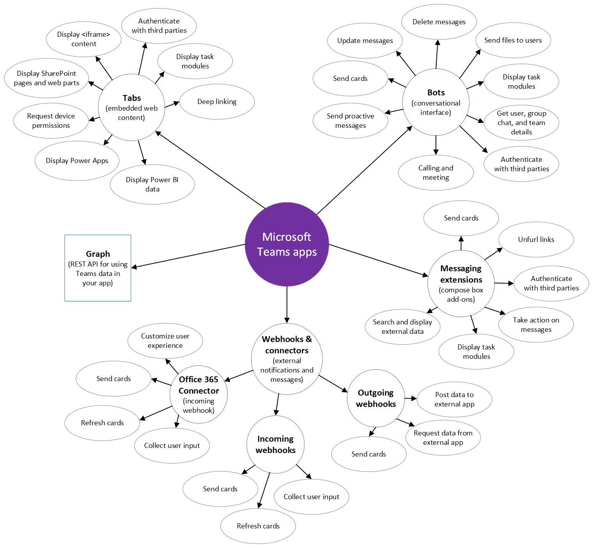

# [Teams Apps开发](https://docs.microsoft.com/en-us/microsoftteams/platform/overview)

Teams是微软开发的一款团队沟通合作的应用，微软为其开放了可扩展定制应用的能力。  

通过扩展apps你可以开发出对接你当前组织业务系统的应用，或者是你自己的小工具。

## [能力](https://docs.microsoft.com/en-us/microsoftteams/platform/concepts/capabilities-overview)

- [选项卡(Tabs)](https://docs.microsoft.com/en-us/microsoftteams/platform/tabs/what-are-tabs)
- [机器人(Bots)](https://docs.microsoft.com/en-us/microsoftteams/platform/bots/what-are-bots)
- [消息扩展(Messaging extensions)](https://docs.microsoft.com/en-us/microsoftteams/platform/messaging-extensions/what-are-messaging-extensions)
- [WebHooks](https://docs.microsoft.com/en-us/microsoftteams/platform/webhooks-and-connectors/what-are-webhooks-and-connectors)
- [Microsoft Graph for Teams](https://docs.microsoft.com/en-us/graph/teams-concept-overview)

能力可以任意组合

### 1.适应于频道，团队，或聊天组的使用方式  

团队，频道和聊天组是协作空间。 使用这些入口点的应用程序可供所有成员使用，并且通常专注于其他工作流程或解锁新的社交互动。

- [选项卡(Tabs)](https://docs.microsoft.com/en-us/microsoftteams/platform/tabs/what-are-tabs) 提供为团队、频道或聊天组配置的全屏嵌入式 web 体验。 所有成员都与基于 web 的内容进行交互，因此典型的体验是无状态的单页面应用。
- [机器人(Bots)](https://docs.microsoft.com/en-us/microsoftteams/platform/bots/what-are-bots) 通过聊天与对话的成员进行交互，并响应事件 (如添加新成员或重命名频道) 。 与这些上下文中的 bot 的对话对团队、频道或聊天组的所有成员都可见，因此应与所有人相关的 bot 对话。
- [消息扩展(Messaging extensions)](https://docs.microsoft.com/en-us/microsoftteams/platform/messaging-extensions/what-are-messaging-extensions) 将外部内容插入到对话中或对邮件执行操作而不离开Teams的快捷方式。 链接 unfurling 在共享公共 URL 中的内容时提供丰富的内容。
- [WebHooks](https://docs.microsoft.com/en-us/microsoftteams/platform/webhooks-and-connectors/what-are-webhooks-and-connectors) 允许外部服务将邮件发布到对话中，并允许用户向服务发送邮件。
- [Microsoft Graph for Teams](https://docs.microsoft.com/en-us/graph/teams-concept-overview) 用于获取有关团队、频道和聊天组的数据，以帮助自动化和管理Teams流程。

### 2.适应于个人应用的使用方式  

个人应用 重点关注与单个用户的交互。 此上下文中的体验对每个用户都是唯一的。 用户可以将个人应用程序固定到左侧导航轨，以便快速访问。
下面介绍了Teams功能在个人环境中的常用功能：

- [机器人(Bots)](https://docs.microsoft.com/en-us/microsoftteams/platform/bots/what-are-bots) 具有与用户的一对一对话。 需要多转对话或提供仅与特定用户相关的通知的 bot 最适用于个人上下文。
- [选项卡(Tabs)](https://docs.microsoft.com/en-us/microsoftteams/platform/tabs/what-are-tabs) 提供了对单个用户有意义的全屏嵌入式 web 体验。

## UI组件  

应用程序通常表现出一个或多个标准Teams UI 组件。 使用这些组件构建应用程序会导致丰富的体验，让Teams用户的本地体验感到不在。  

- [卡片(Card)](https://docs.microsoft.com/en-us/microsoftteams/platform/task-modules-and-cards/what-are-cards) 由 JSON 定义的 UI 容器，可包含带格式的文本、媒体、控件 (如下拉列表和单选按钮) 和触发操作的按钮。
卡片操作可向应用程序的 API 发送有效负载、打开链接、启动身份验证流或向对话发送邮件。 Teams平台支持多张卡片，包括自适应卡片、英雄卡片、缩略图卡片等。 您可以组合卡片集合并显示在列表或轮播中。
- [任务模块(Task modules)](https://docs.microsoft.com/en-us/microsoftteams/platform/task-modules-and-cards/what-are-task-modules) 在Teams中提供了模态体验。 它们对于启动工作流、收集用户输入或显示丰富的信息（如视频或 Power BI 仪表板）尤其有用。 在任务模块中，可以运行自定义前端代码、显示 `<iframe>` 小部件或显示自适应卡片。  
考虑您想要如何构建应用程序时，请记住，模式是用户输入信息或完成任务（与选项卡或基于对话的 bot 体验相比）的自然。
- [深层链接(Deep links)](https://docs.microsoft.com/zh-cn/microsoftteams/platform/concepts/build-and-test/deep-links)  您的应用程序可以创建 URL 深层链接 ，以帮助您通过您的应用程序和Teams客户端导航您的用户。 您可以为 Teams 中的大多数实体创建深层链接，有些 (像新的会议请求) 允许您使用 URL 中的查询字符串预填充信息。  
例如，您的会话自动程序可以向频道发送一封邮件，其中包含指向任务模块的深层链接，从而将一个卡片作为一对一的邮件发送给用户，这又包含一个深层链接，以便在特定日期/时间使用特定用户新建会议。 使用深层链接可在应用程序可用的各种扩展点之间进行连接，始终保持用户在正确的上下文中的持续时间。
- [Web内容页(Content page)](https://docs.microsoft.com/en-us/microsoftteams/platform/tabs/how-to/create-tab-pages/content-page) 基于 Web 的内容 是您托管的可以嵌入到选项卡或任务模块中的网页。
