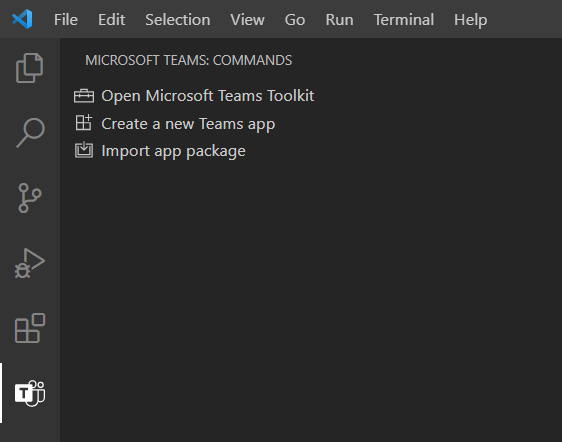
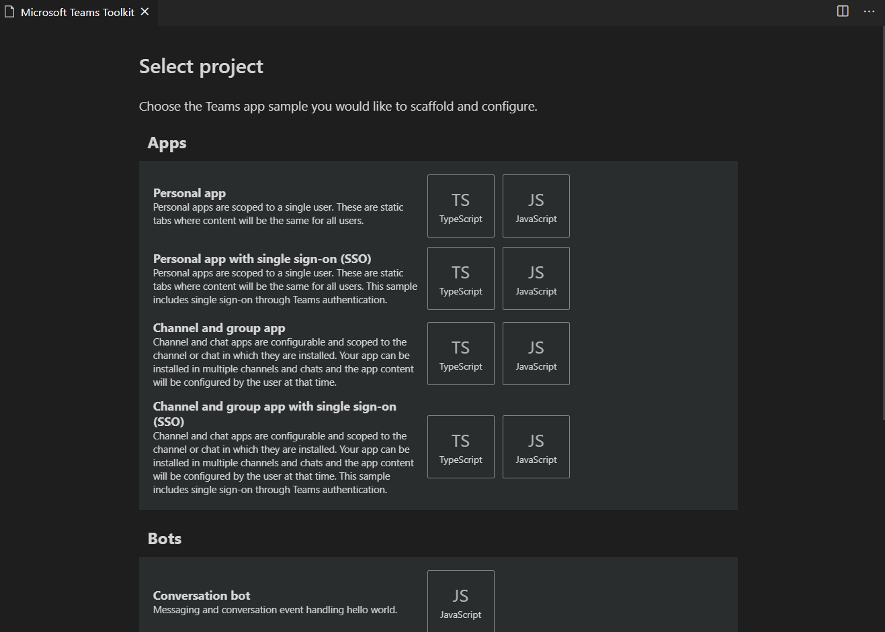
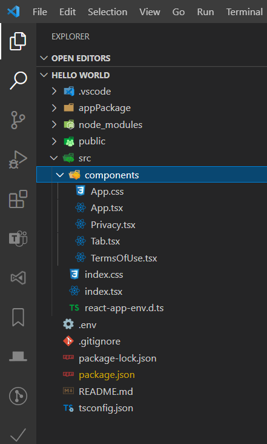
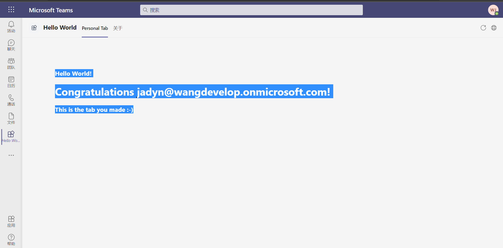

# 构建并运行你的第一个Teams应用。Hello World

## 1. 创建应用项目

使用 Visual Studio Code的Microsoft Teams Toolkit 扩展设置你的第一个应用项目。 使用以下步骤创建应用项目：

1. 在Visual Studio Code中，选择左侧活动栏上的 **Microsoft Teams**， 然后选择 "**创建新的 Teams 应用**"。  

2. 当系统提示时，使用 Microsoft 365 开发帐户登录。
3. 在"**添加功能**"屏幕上，选择 "**Apps**下的**Personal app**" ， 然后选择"下一步"。 
4. 输入 Teams 应用的名称。 (这是应用的默认名称，也是本地计算机上应用项目目录的名称。)
5. 仅选中 **个人选项卡**选项，然后选择 屏幕底部的"完成"以配置项目。

## 2. 了解重要的应用项目组件

当工具包配置完毕了你的项目，你就拥有为Teams构建基本个人选项卡的组件。在Visual Studio Code的资源管理器区域显示项目目录和文件。  

### 应用脚手架

该工具包会根据你在安装过程中添加的功能，在`src`目录中自动为你创建脚手架。

例如，如果在安装过程中创建选项卡，则`src/components`目录中的`App.js`(TS为`App.tsx`)文件很重要，因为它可以处理应用程序的初始化和路由。它调用[Microsoft Teams JavaScript client SDK](https://docs.microsoft.com/en-us/microsoftteams/platform/tabs/how-to/using-teams-client-sdk)来建立你的应用程序与Teams之间的通信。

### 应用ID

使用App Studio配置你的应用的Teams app ID。在你的项目的`package.json`文件中`teamsAppId`对象中查看ID

## 3.构建并运行你的应用

在本地构建和运行你的应用，以节省时间。该README信息也可在工具箱中获得。使用以下步骤构建和运行你的应用程序：

   1. 在终端中，转到你的应用程序项目的根目录，然后运行`npm install`。
   2. 运行`npm start`。

完成后，编译成功！终端中的消息。你的应用正在运行`https://localhost:3000`。

## 4.在Teams中侧载你的应用

你的应用已准备好在Teams中进行测试。为此，你必须具有一个允许应用程序侧面加载的Microsoft 365开发帐户。有关开设帐户的更多信息，请参阅[Teams开发帐户](https://docs.microsoft.com/en-us/microsoftteams/platform/build-your-first-app/build-first-app-overview#set-up-your-development-account)。

使用以下步骤在Teams中侧载你的应用程序：
注意
要在Teams中侧载应用之前需要启用侧载，请按照[开启应用侧载](https://docs.microsoft.com/en-us/microsoftteams/platform/concepts/build-and-test/prepare-your-o365-tenant#enable-custom-teams-apps-and-turn-on-custom-app-uploading)的步骤进行操作。

   1. 选择F5键以在Visual Studio Code中启动Teams Web客户端。
   2. 要在Teams中显示你的应用内容，请指定你的应用运行的位置（localhost）是可信任的：
        1. 在按F5后打开的同一浏览器窗口（默认为Google Chrome）中打开一个新标签。
        2. 转到`https://localhost:3000/tab`并继续该页面。
   3. 回到Teams。在对话框中，选择“为我添加”以安装你的应用。 屏幕截图显示了示例`Hello World`  在Teams中运行的个人标签应用程序。
   

🎉恭喜！你的应用正在Teams中运行。
