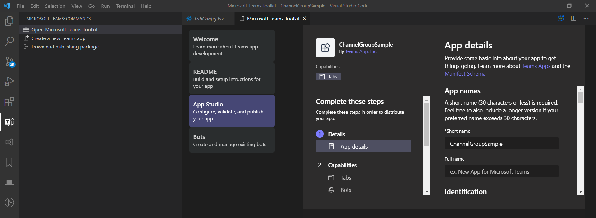

# [为Microsoft Teams构建频道和聊天组选项卡](https://docs.microsoft.com/en-us/microsoftteams/platform/build-your-first-app/build-channel-tab)

## 1. 创建应用项目

与 [Hello World示例](./2.helloworld.md) 步骤类似，仅需修改创建项目类型为 **Channel and group app**  

## 2.了解应用项目组件

### 应用配置

你可以直接在工具包的**App Studio**中修改应用配置


### 应用脚手架

工具包创建基础脚手架项目:

- 位于项目`src/components`目录中的两个文件：
  - `Tab.js`用于渲染选项卡的内容页面。
  - `TabConfig.js`用于渲染选项卡的配置页面。
- `Microsoft Teams JavaScript client SDK`，预装在你项目的前端组件中。

## 3. 自定义你的选项卡内容页

```javascript
<div>
  <h1>Important Contacts</h1>
    <ul>
      <li>Help Desk: <a href="mailto:support@company.com">support@company.com</a></li>
      <li>Human Resources: <a href="mailto:hr@company.com">hr@company.com</a></li>
      <li>Facilities: <a href="mailto:facilities@company.com">facilities@company.com</a></li>
    </ul>
</div>
```

前往 `src/components` 目录然后打开`Tab.js`. 定位到`render()`函数然后粘贴上述内容替换`return()`内容(如下).

```javascript
render() {

    let userName = Object.keys(this.state.context).length > 0 ? this.state.context['upn'] : "";

    return (
    <div>
      <h1>Important Contacts</h1>
        <ul>
          <li>Help Desk: <a href="mailto:support@company.com">support@company.com</a></li>
          <li>Human Resources: <a href="mailto:hr@company.com">hr@company.com</a></li>
          <li>Facilities: <a href="mailto:facilities@company.com">facilities@company.com</a></li>
        </ul>
    </div>
    );
}
```

将以下规则添加到应用`App.css`（同样位于`src/components`中），因此无论使用哪个主题，电子邮件链接都更易于阅读。

```css
a {
  color: inherit;
}
```

## 4. 自定义你的选项卡配置页面

频道或聊天中的每个选项卡都有一个配置页面，一个至少有一个设置选项的模态，在用户添加你的应用时显示。默认情况下，配置页面会询问用户是否希望在安装标签时通知频道或聊天。  

在你的配置页中添加一些自定义内容。进入你的项目的`src/components`目录，打开`TabConfig.js`，更新`return()`里面的占位符内容（如下例所示）。

```javascript
return (
    <div>
      <h1>Add My Contoso Contacts</h1>
      <div>
        Select <b>Save</b> to add our organization's important contacts to this workspace.
      </div>
    </div>
);
```

至少，在这个页面上提供一些关于您的应用程序的简要信息，因为这可能是用户第一次了解它。你还可以包括自定义配置选项或认证工作流程，这在标签配置页面上很常见。

## 5. 提供一个建议的标签名称

当您添加频道选项卡时，默认情况下会显示应用程序名称（例如，first-app）。

这可能很好，这取决于你如何称呼你的应用程序，但你可能希望提供一个在小组协作背景下更有意义的名称（例如，团队联系人）。

1. 在`TabConfig.js`中，转到`microsoftTeams.settings.setSettings`。
2. 添加建议的`DisplayName`属性，其中包含您希望默认显示的标签名称。
3. 使用下面示例中提供的名称或键入您的名称。默认情况下，用户可以更改名称）。

```javascript
const baseUrl = `https://${window.location.hostname}:${window.location.port}`;
microsoftTeams.settings.setSettings({
    "suggestedDisplayName": "Team Contacts",
    "entityId": "Test",
    "contentUrl": baseUrl + "/tab",
    "websiteUrl": baseUrl + "/tab"
});
```

## 6. 编译并运行你的应用

为了节省时间，你将在本地建立和运行你的应用程序。

(这些信息也可以在工具包README中找到。)

1. 在终端中，进入你的应用项目的根目录，运行`npm install`。
2. 运行`npm start`。

一旦完成，在终端中会有一条 **Compiled successfully!** 的消息。你的应用程序正在运行在`https://localhost:3000`。

## 7.在Teams中侧载你的应用

- 与[Hello World](./2.helloworld.md#4在teams中侧载你的应用) 中侧载你的应用步骤类似
- 转到Teams中，在模态中，选择**添加到团队**或**添加到聊天**，然后定位一个**频道**或者**聊天**用于测试
  


- 选择 "保存 "来配置选项卡。显示内容页面。


## 完成  

你拥有了一个带有选项卡的团队应用，可以在频道和聊天中显示有用的内容。你有一个团队应用，其中有一个选项卡用于在频道和聊天中显示有用的内容。
