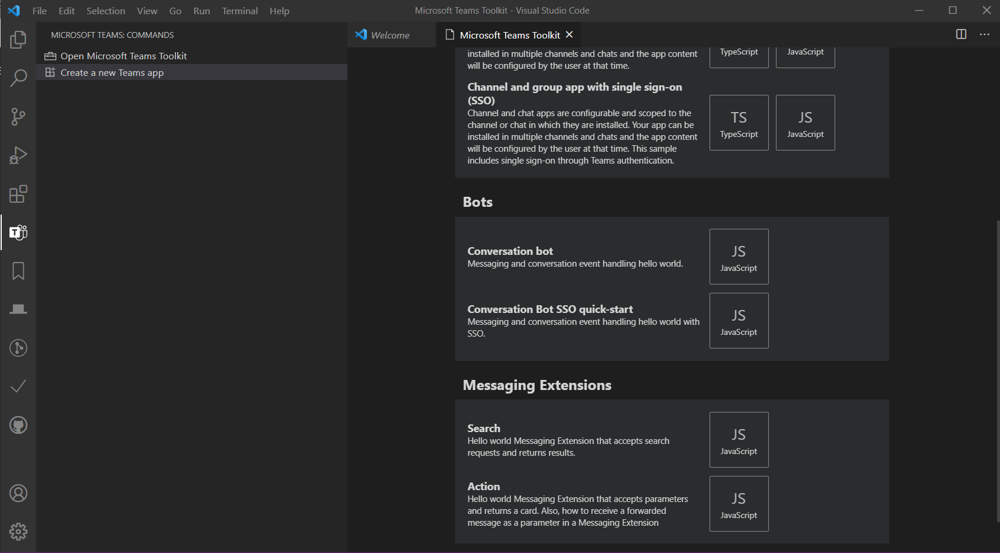
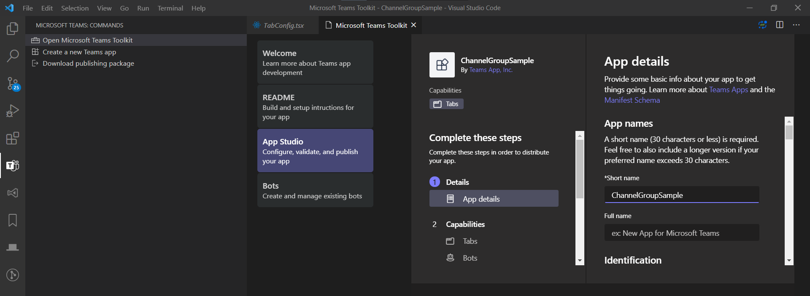

# [为Microsoft Teams构建机器人](https://docs.microsoft.com/en-us/microsoftteams/platform/build-your-first-app/build-bot)

## 开始前的先决条件

请确保已经完成[先决条件](./1.overview.md#先决条件)

## 1. 创建应用项目

Microsoft Teams Toolkit 可帮助您为应用设置以下组件：

- 与机器人相关的应用配置和脚手架
- 自动注册微软 Azure 机器人服务的机器人

 提示

如果您以前没有创建过"团队"应用项目，则可能会发现按照这些说明更详细地解释项目很有帮助。

1. 在**Visual Studio Code**中，选择左侧活动栏上的Microsoft Teams，然后选择"**创建新的Teams应用**"。
2. 提示后，请登录您的 **Microsoft 365 开发帐户**。
3. 在**添加功能**屏幕上，选择**对话机器人(Conversation bot)**然后"下一步"。

4. 输入**Teams应用**的名称（这是应用的默认名称，也是本地计算机上的应用项目目录的名称。）
5. 转到**配置机器人**并选择**创建一个新的机器人**，然后**创建机器人注册**。如果成功，您的新机器人将为**已注册**状态。
6。 选择屏幕底部的**完成**，并选择创建项目的位置。

## 2.了解应用项目组件

### 应用配置

你可以直接在工具包的**App Studio**中修改应用配置

### 应用脚手架

工具包创建基础脚手架项目:

应用程序脚手架提供了一个位于项目根目录下的`botActivityHandler.js`文件，用于处理您的机器人如何处理Teams中的活动（例如，机器人如何响应 "你好 "等特定消息）。
